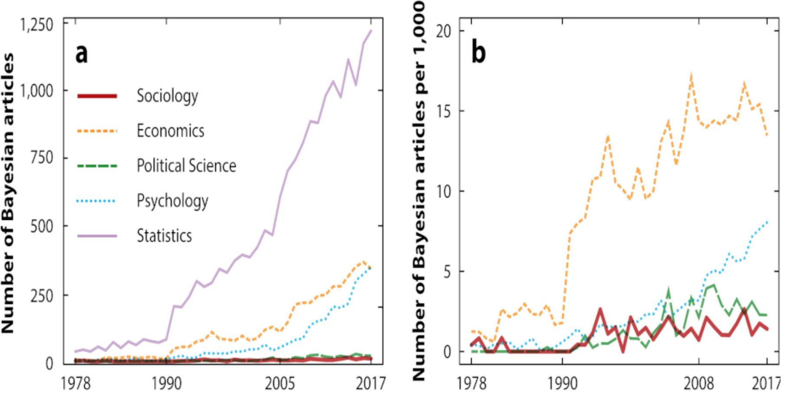

<style type="text/css">
slides > slide:not(.nobackground):after {
  content: '';
}
</style>

<script type="text/x-mathjax-config">
MathJax.Hub.Register.StartupHook("TeX Jax Ready",function () {
  MathJax.Hub.Insert(MathJax.InputJax.TeX.Definitions.macros,{
    cancel: ["Extension","cancel"],
    bcancel: ["Extension","cancel"],
    xcancel: ["Extension","cancel"],
    cancelto: ["Extension","cancel"]
  });
});
</script>


```{r setup, include=FALSE}
options(width = 90)
library(knitr)
library(rgl)
knit_hooks$set(rgl = hook_plot_custom)
knit_hooks$set(small.mar = function(before, options, envir) {
    if (before) par(mar = c(4, 4, .1, .1), las = 1)  # smaller margin on top and right
})
```

## Logistics

- Syllabus on Brightspace everything else at https://github.com/bgoodri/APSTA-GE-2123_2022
- Prerequisites: Good understanding of probability and either fluent in R or can read R and write Python
- Bring laptops each Wednesday
- We will take a couple of breaks
- EdStem participation (worth $\frac{1}{6}$)
- Two homeworks (worth $\frac{1}{4}$ each) and a final project / paper (worth $\frac{1}{3}$) using what we learn
- Office hours online, can sign up for Thursday afternoon at https://tinyurl.com/GR5065

## Obligatory Disclosure

* Ben is an employee of Columbia University, which has received several research grants to develop Stan
* Ben is also a manager of GG Statistics LLC, which uses Stan for business
* According to Columbia University 
  [policy](https://research.columbia.edu/content/conflict-interest-and-research), any such employee who 
  has any equity stake in, a title (such as officer or director) with, or is expected to earn at least 
  $\$5,000.00$ per year from a private company is required to disclose these facts in presentations

<div style="float: left; width: 60%;">
<video width="500" height="250" controls>
  <source src="https://video.twimg.com/ext_tw_video/999106109523742720/pu/vid/640x360/ljdUoEqXji0ES_CV.mp4?tag=3" type="video/mp4">
Your browser does not support the video tag.
</video> 
</div>
<div style="float: right; width: 40%;">
```{r, echo = FALSE, message = FALSE, fig.height=3, fig.width=4.5}
pp2 <- cranlogs::cran_downloads(package = "rstan", from = "2015-07-01", to = Sys.Date())
library(ggplot2)
ggplot(pp2,aes(x = date, y = count)) +
  geom_smooth(show.legend = FALSE, se = FALSE) +
  geom_hline(yintercept = 0) + 
  geom_vline(xintercept = as.numeric(as.Date("2018-05-20")), color = "red") +
  labs(x = 'Date', y = 'Daily downloads',
    title = 'RStan Daily Downloads from RStudio Mirror',
    caption = "Season 3, Episode 9 of Billions") +
  theme(plot.caption = element_text(color = "red", face = "italic"))
```
</div>

## Bayesian Articles (from [Lynch and Bartlett 2019](https://www.annualreviews.org/doi/abs/10.1146/annurev-soc-073018-022457))

```{r, echo = FALSE, fig.width=10, fig.height=5}

```

## Quotes from McElreath (2020, p.3)

> - "statistics is neither mathematics nor a science, but rather a branch of engineering"

> - "Advanced courses in statistics do emphasize engineering, but most scientists never get that far. Teaching statistics this way is like teaching engineering backwards, starting with bridge building and ending with basic physics."

> - "Serious trouble begins when scholars move on to conducting innovative research, pushing the boundaries of their specialties. It's as if we got our hydraulic engineers by promoting plumbers."

> - "Why aren’t the tests enough for innovative research? The classical procedures of introductory statistics tend to be inflexible and fragile. By inflexible, I mean that they have very limited ways to adapt to unique research contexts. By fragile, I mean that they fail in unpredictable ways when applied to new contexts."

## Four or Five Sources of Uncertainty

1. Uncertainty about parameters in models
2. Uncertainty about which model is best
3. Uncertainty about what to do with the output of the (best) model(s)
4. Uncertainty about whether the software works as intended
5. Uncertainty about whether the (best) model(s) hold with other data

* Bayesians use probability to describe their uncertainty in (1) and (2)
* The Bayesian approach links with decision theory, which prescribes (3)
* The Stan software does as much as we can to mitigate (4)
* By implication, other approaches / software may refer to probability
  but fail to handle one or more of the above five items
* These include  randomization inference, Frequentist inference, supervised 
  learning, and others

## Random Variables (R.V.) {.build}

- A function is a rule that UNIQUELY maps each element of an input set to some element of an output set, e.g. $e^x$ maps real numbers $\left(\mathbb{R}\right)$ to 
non-negative real numbers $\left(\mathbb{R_+}\right)$
- A random variable is a FUNCTION from the sample space, $\Omega$, to some subset of $\mathbb{R}$ with a probability-based rule
- If $\Omega$ is discrete with a finite number of elements, then we can simply 
  enumerate an equivalent number of probabilities to define a random variable
```{r}
die  <- 1:6 # Omega in this case
roll <- sample(die, size = 1, prob = rep(1 / 6, times = 6)) # code calls a function
# roll is a realization of the function
```
- Do not conflate a REALIZATION of a R.V. with the FUNCTION that generated it
- By convention, a capital letter, $X$, indicates a R.V.
and its lower-case counterpart, $x$, indicates a realization of $X$

## A Frame of Bowling

Each frame in bowling starts with $n=10$ pins & you get up to 2 rolls per frame
```{r, echo = FALSE}
vembedr::embed_url("https://youtu.be/HeiNrSllyzA?t=05")
```

## Approaching Bowling Probabilistically {.build}

> - What is $\Omega$ for the number of pins knocked down in the first roll of a frame?
> - If $b^p = y$, then $\log_b\left(y\right) = p$. Let the probability of knocking down 
  $X$ out of $n$ pins be given by a form of [Benford's Law](https://en.wikipedia.org/wiki/Benford%27s_law):
  $\Pr\left(x \mid n\right) = \log_{n + 2}\left(1 + \frac{1}{n + 1 - x}\right)$
```{r, Pr}
# probability of knocking down x out of n pins
Pr <- function(x, n = 10) ifelse(x > n, 0, log(1 + 1 / (n + 1 - x), base = n + 2))
Omega <- 0:10 # 0, 1, ..., 10
names(Omega) <- as.character(Omega)
source("bowling.R") # does the above

x <- sample(Omega, size = 1, prob = Pr(Omega)) # realization of bowling random variable
round(c(Pr(Omega), total = sum(Pr(Omega))), digits = 5)
```

## (In)dependence

- Loosely, $A$ and $B$ are independent propositions if $A$ being true or false tells
  us nothing about the probability that $B$ is true (and vice versa)
- Formally, $A$ and $B$ are independent iff $\Pr\left(\left.A\right|B\right)=\Pr\left(A\right)$
  (and $\Pr\left(\left.B\right|A\right)=\Pr\left(B\right)$). Thus, 
  $\Pr\left(A\bigcap B\right)=\Pr\left(A\right)\times\Pr\left(B\right)$,
  instead of the general case
  $\Pr\left(A\bigcap B\right)=\Pr\left(A\right)\times\Pr\left(B \mid A\right) = 
  \Pr\left(B\right) \Pr\left(A \mid B\right)$
  
- Why is it reasonable to think
    - Two rolls in the same frame are not independent?
    - Two rolls in different frames are independent?
    - Rolls by two different people are independent regardless of whether they are in the same frame?

> - What is the probability of obtaining a turkey (3 consecutive strikes)?
> - What is the probability of knocking down $x$ pins then $10 - x$ pins 
  in a frame?
  
## Joint Probability of Two Rolls in Bowling

- How to obtain the joint probability, $\Pr\left(x_{1}\bigcap x_{2}\mid n=10\right)$, in general?

$$\Pr\left(x_1 \bigcap x_2 \mid n = 10\right) =  
\Pr\left(x_1 \mid n = 10\right) \times \Pr\left(x_{2}\mid n = 10 - x_1 \right) = $$
$$\log_{12}\left(1 + \frac{1}{11 - x_1}\right) \times
 \log_{12 - x_1}\left(1 + \frac{1}{11 - x_1 - x_2}\right) \times
\mathbb{I}\{x_1 + x_2 \leq 10\}$$

```{r, joint}
joint_Pr <- matrix(0, nrow = length(Omega), ncol = length(Omega))
rownames(joint_Pr) <- colnames(joint_Pr) <- as.character(Omega)
for (x1 in Omega) { # already created by source("bowling.R")
  Pr_x1 <- Pr(x1, n = 10)
  for (x2 in 0:(10 - x1)) joint_Pr[x1 + 1, x2 + 1] <- Pr_x1 * Pr(x2, n = 10 - x1)
}
sum(joint_Pr) # that sums to 1
```

## `joint_Pr`: row index is roll 1; column is roll 2 {.smaller}

```{r, size='footnotesize', echo = FALSE, message = FALSE}
library(kableExtra)
library(dplyr)
options("kableExtra.html.bsTable" = TRUE)
options(scipen = 5)
tmp <- as.data.frame(joint_Pr)
for (i in 1:ncol(tmp)) 
  tmp[,i] <- cell_spec(round(tmp[,i], digits = 6), "html", bold = tmp[,i] == 0,
                       color = ifelse(tmp[,i] == 0, "red", "black"))
kable(tmp, digits = 5, align = 'c', escape = FALSE) %>%
    kable_styling("striped", full_width = FALSE)
```

## What is the probability that $X_2 = 9$? {.smaller}

```{r, size='footnotesize', echo = FALSE, message = FALSE}
tmp <- as.data.frame(joint_Pr)
for (i in 1:ncol(tmp)) 
  tmp[,i] <- cell_spec(round(tmp[,i], digits = 6), "html", bold = tmp[,i] == 0,
                       color = ifelse(tmp[,i] == 0, "red", "black"))
kable(tmp, digits = 5, align = 'c', escape = FALSE) %>%
    kable_styling("striped", full_width = FALSE)
```

## Marginal Probabilities from Joint Probabilities {.smaller}

```{r, size='footnotesize', echo = FALSE, message = FALSE}
tmp <- as.data.frame(cbind(joint_Pr, " " = -1, "row-sum" = rowSums(joint_Pr)))
tmp <- rbind(tmp, " " = -1, "col-sum" = colSums(tmp))
for (i in 1:ncol(tmp)) 
  tmp[,i] <- cell_spec(round(tmp[,i], digits = 6), "html", 
                       bold = tmp[,i] == 0,
                       color = ifelse(tmp[,i] == 0, "red", 
                                      ifelse(tmp[,i] > 1 - 1e-8 | tmp[,i] < 0, 
                                             "white", "black")))
kable(tmp, digits = 5, align = 'c', escape = FALSE) %>%
    kable_styling("striped", full_width = FALSE)
```

## Marginal Distribution of Second Roll in Bowling

- How to obtain $\Pr\left(x_2\right)$ irrespective of $x_1$?
- Since events in the first roll are mutually exclusive, use the simplified
form of the Addition Rule to "marginalize":
$$\begin{eqnarray*}
\Pr\left(x_{2}\right) & = & 
\sum_{x = 0}^{10}\Pr\left(X_1 = x\bigcap X_2 = x_{2}\mid n = 10\right)\\
 & = & \sum_{x = 0}^{10}
 \Pr\left(x\mid n = 10\right) \times \Pr\left(x_{2}\mid n = 10 - x\right)
\end{eqnarray*}$$
- This corresponds to a column-wise sum of `joint_Pr`

> - Better notation might be $\Pr\left( \cancel{x_1} \bigcap x_2 \mid n = 10\right)$


## Marginal, Conditional, and Joint Probabilities

> - To compose a joint (in this case, bivariate) probability, MULTIPLY a marginal probability by
  a conditional probability
> - To decompose a joint (in this case, bivariate) probability, ADD the relevant joint probabilities
  to obtain a marginal probability
> - To obtain a conditional probability, DIVIDE the joint probability (in this case, bivariate) by 
  the marginal probability of the event that you want to condition on because
$$\Pr\left(A\bigcap B\right)=\Pr\left(B\right)\times\Pr\left(A \mid B\right) =
\Pr\left(A\right)\times\Pr\left(B\mid A\right) \implies$$
$$\Pr\left(A \mid B\right)= \frac{\Pr\left(A\right)\times\Pr\left(B \mid A\right)}{\Pr\left(B\right)} 
\mbox{ if } \Pr\left(B\right) > 0$$
> - This is Bayes' Rule  
> - What is an expression for $\Pr\left(X_1 = 3 \mid X_2 = 4\right)$ in bowling?

## Conditioning on $X_2 = 4$ in Bowling {.smaller}

```{r, size='footnotesize', echo = FALSE}
tmp <- as.data.frame(joint_Pr)
for (i in 1:ncol(tmp)) 
  tmp[,i] <- cell_spec(round(tmp[,i], digits = 6), "html", bold = tmp[,i] == 0,
                       color = ifelse(tmp[,i] == 0, "red", 
                                      ifelse(i == 5, "black", "blue")))
kable(tmp, digits = 5, align = 'c', escape = FALSE) %>%
    kable_styling("striped", full_width = FALSE)
```

## $\Pr\left(X_1 = 3 \mid X_2 = 4\right)$ by Sims vs. Bayes' Rule {.build}

```{r, sims, cache = TRUE, message = FALSE}
library(dplyr)
S <- 10^7 # practically infinite
tibble(x_1 = sample(Omega, size = S, replace = TRUE, prob = Pr(Omega))) %>%
  group_by(x_1) %>% # given each value of x_1 ...
  # ... draw from conditional probability distribution of x_2
  mutate(x_2 = sample(Omega, size = n(), replace = TRUE, 
                      prob = Pr(Omega, n = 10 - first(x_1)))) %>%
  ungroup %>%
  filter(x_2 == 4) %>%
  summarize(simulated = mean(x_1 == 3)) %>%
  mutate(exact = joint_Pr["3", "4"] / sum(joint_Pr[ , "4"])) %>%
  print(digits = 4)
```

## Bayesian vs Frequentist Probability

- Bayesians generalize this by taking $A$ to be "beliefs about whatever you do not know" and $B$ to be whatever you do know in 
$$\Pr\left(\left.A\right|B\right)= \frac{\Pr\left(A\right)\times\Pr\left(\left.B\right|A\right)}{\Pr\left(B\right)} \mbox{ if } \Pr\left(B\right) > 0$$
- Frequentists accept the validity Bayes' Rule but object to using the language of probability to describe 
  beliefs about unknown propositions and insist that probability is a property of a process 
  that can be defined as a limit
$$\Pr\left(A\right) = \lim_{S\uparrow\infty} 
\frac{\mbox{times that } A \mbox{ occurs in } S \mbox{ independent randomizations}}{S}$$

## Probability that a Huge Odd Integer is Prime

> - John Cook [asks](https://www.johndcook.com/blog/2010/10/06/probability-a-number-is-prime/)
  an interesting question: What is the probability $x$ is prime, where $x$ is a huge, odd integer
  like $1 + 10^{100,000,000}$?
    
> - To Frequentists, $x$ is not a random variable. It is either prime or composite and it makes no
  sense to say that it is "probably (not) prime"
> - To Bayesians, $x$ is either prime or composite but no one knows for sure which
> - The prime number theorem implies provides a way to choose the prior probability that
  $x$ is prime based on its number of digits, $\left(d\right)$
$$\Pr\left(x \mbox{ is prime} \mid d\right) = \frac{1}{d \ln 10} \approx \frac{1}{2.3 \times 10^{10}}$$
  although you could double that by taking into account that $x$ is odd

> - What is the probability that $\beta > 0$ in a regression model?


## A Very, Very Frequentist Example

- Suppose you plan to collect $N$ iid observations on a count outcome $\left(Y\right)$ 
  that are generated according to a Poisson distribution with expectation $\mu$
- What probability distribution does the the sample mean follow?

>- Let $S = \sum_{n = 1}^N y_n$ and $\overline{y} = \frac{S}{N}$. The probability that $Y$ 
takes the value $y$ is 
$$\Pr\left(Y = y \mid \mu\right) = \frac{\mu^y e^{-\mu}}{y!}$$
>- The probability of observing the entire sample of size $N$ is
$$\Pr\left(y_1, y_2, \dots y_N \mid \mu\right) = 
  \prod_{n = 1}^N \frac{\mu^{y_n} e^{-\mu}}{y_n!} = 
  e^{-N \mu} \frac{\mu^{\sum_{n = 1}^N y_n}}{\prod_{n = 1}^N y_n!} = 
  \frac{\mu^S e^{-N \mu}}{?}$$
>- ? must be $S!$ to make this a PMF, namely Poisson with expectation $N\mu$

## A Special Case of the Central Limit Theorem

>- If $S$ is distributed Poisson with expectation $N\mu$, then $\overline{y} = \frac{S}{N}$ has expectation $\mu$
  and $\overline{y} = \frac{S}{N}$ has variance $\frac{N\mu}{N^2} = \frac{\mu}{N}$
>- As $N \uparrow \infty$, $N\mu \uparrow \infty$, in which case we can utilize
Stirling's approximation to the factorial to 
[show](https://math.stackexchange.com/questions/3962772/normal-approximation-to-poisson-distribution) that the Poisson distribution approaches the normal
>- So as $N \uparrow \infty$, $\overline{y} = \frac{S}{N}$ is distributed normal with
  expectation $\mu$ and standard deviation $\sqrt{\frac{\mu}{N}}$ and thus
  $z = \frac{y - \mu}{\sqrt{\frac{\mu}{N}}}$ is distributed standard normal
>- Among random variables over $\mathbb{R}$ with a given expectation and variance,
  the normal distribution maximizes differential entropy
>- Simulate the convergence of $\widehat{y}$ to a normal

## Frequentist Perspective on Probability

- Probability is necessitated by deliberate randomization, such as sampling
- Probability of $X$ is interpreted as the proportion of times $X$ happens in the
  limit as the number of random trials approaches infinity
- The probability statements pertain to estimators (or functions thereof)
- Sample mean is distributed normally across datasets (iff variance exists)
- Maximum likelihood estimates are distributed normally across datasets
- The probability statements are always pre-data
- The probability statements are conditional on the parameters being estimated

>- What use is this Frequentist perspective on probability for applied research?

## Quotes from McElreath (2020, p.4&10)

- "The greatest obstacle that I encounter among students and colleagues is the tacit belief that the proper objective of statistical inference is to test null hypotheses"
    - Hypotheses are not models
    - Measurement error prevents deductive falsification
- "what researchers need is ... a set of principles for designing, building, and refining special-purpose statistical procedures. Every major branch of statistical philosophy possesses such a unified theory. But the theory is never taught in introductory ... courses. So there are benefits in rethinking statistical inference as a set of strategies, instead of a set of pre-made tools."

1. Bayesian data analysis 
2. Multilevel models
3. Model comparison using information criteria
4. Graphical Causal Models / Directed Acyclic Graphs

## Probability and Cumulative Mass Functions

- $\Pr\left(X = x \mid \boldsymbol{\theta}\right)$ is a Probability Mass Function (PMF) 
over a discrete $\Omega$ that may depend on some parameter(s) $\boldsymbol{\theta}$ and thus the 
Cumulative Mass Function (CMF) is 
$\Pr\left(X\leq x \mid \boldsymbol{\theta}\right)=\sum\limits_{i = \min\{\Omega\} }^x\Pr\left(X = i \mid \boldsymbol{\theta}\right)$
- In bowling, 
$\Pr\left(X\leq x \mid n \right) = 1 - \log_{n + 2}\left(1 + n - x\right)$
```{r}
CMF <- 1 - log(10 + 1 - Omega, base = 10 + 2)
round(rbind(CMF = CMF, PMF = Pr(Omega)), digits = 4)
```
- How does `CMF` relate to our PMF:
$\Pr\left(x \mid n\right) = \log_{n + 2}\left(1 + \frac{1}{n + 1 - x}\right)$?

## PMF is the Rate of Change in the CMF

```{r, echo=FALSE, fig.height=6,fig.width=9}
par(mar = c(5,4,0.5,0.5) + .1, las = 1)
cols <- rainbow(11)
x <- barplot(CMF, xlab = "Number of pins", ylab = "Probability of knocking down at most x pins", 
             col = cols, density = 0, border = TRUE)[,1]
for(i in 0:9) {
  j <- i + 1L
  points(x[j], CMF[j], col = cols[j], pch = 20)
  segments(x[j], CMF[j], x[j + 1L], CMF[j + 1L], col = cols[j], lty = 2)
}
abline(h = 1, lty = "dotted")
points(x[11], 1, col = cols[11], pch = 20)
```

## Cumulative Density Functions {.build}

> - Now $\Omega$ is an interval; e.g. $\Omega=\mathbb{R}$, $\Omega=\mathbb{R}_{+}$,
$\Omega=\left(a,b\right)$, etc.
> - $\Omega$ has an infinite number of points with zero width, so $\Pr\left(X = x\right) \downarrow 0$
> - $\Pr\left(X\leq x\right)$ is called the Cumulative Density Function (CDF) from $\Omega$ to 
$\left[0,1\right]$
> - No conceptual difference between a CMF and a CDF except emphasis on
whether $\Omega$ is discrete or continuous so we use 
$F\left(\left.x\right|\boldsymbol{\theta}\right)$ for both

## From CDF to a Probability Density Function (PDF)

> - $\Pr\left(a<X\leq x\right)=F\left(x \mid \boldsymbol{\theta}\right)-F\left(a \mid \boldsymbol{\theta}\right)$
as in the discrete case
> - If $x=a+h$, $\frac{F\left(x \mid \boldsymbol{\theta}\right)-F\left(a \mid \boldsymbol{\theta}\right)}{x-a}=\frac{F\left(a+h \mid \boldsymbol{\theta}\right)-F\left(a \mid \boldsymbol{\theta}\right)}{h}$ is the slope of a line segment
> - If we then let $h\downarrow0$, $\frac{F\left(a+h \mid \boldsymbol{\theta}\right)-F\left(a \mid \boldsymbol{\theta}\right)}{h}\rightarrow\frac{\partial F\left(a \mid \boldsymbol{\theta}\right)}{\partial a}\equiv f\left(x \mid \boldsymbol{\theta}\right)$
is still the RATE OF CHANGE in $F\left(x \mid \boldsymbol{\theta}\right)$ at $x$, i.e.
the slope of the CDF at $x$
> - The derivative of $F\left(x\right)$ with respect to $x$ is the Probability
Density Function (PDF) & denoted $f\left(x\right)$, which is always positive because the CDF increases
> - $f\left(x\right)$ is NOT a probability (it is a probability's slope) but is used like a PMF
> - Conversely, $F\left(x\mid\theta\right) = \int_{-\infty}^x f\left(x \mid \theta\right)dx$
  is the area under the PDF up to $x$
> - Can use WolframAlpha to take [derivatives](https://www.wolframalpha.com/input/?i=partial+derivative)
  or do (some) [definite integrals](https://www.wolframalpha.com/input/?i=definite+integral) 
  but NYU students can and should [download](https://www.nyu.edu/life/information-technology/computing-support/software/software/mathematica.html) 
  the full Mathematica for free. Also, you can do symbolic stuff in Python, whether 
  [locally](https://www.sympy.org/en/index.html) or [online](https://www.sympygamma.com/).

## Correspondence between Discrete & Continuous

Concept  | Discrete $X$ and $Y$  | Continuous $X$, $Y$, and $\theta$ | Comment
-- | ----- | ---- | -------
Cumulative      | $F\left(x \mid \theta\right) = \Pr\left(X \leq x \mid \theta\right)$  | $F\left(x \mid \theta\right) = \Pr\left(X \leq x \mid \theta\right)$ | CMF & CDF are the same concept
Median | $\arg\min_x:F\left(x \mid \theta\right) \geq \frac{1}{2}$ | $F^{-1}\left(\frac{1}{2} \mid \theta\right) = x$ | $F^{-1}\left(p\right)$ is an inverse CDF
Rate of Change  | $\Pr\left(x \mid \theta \right) = \frac{F\left(x \mid \theta \right) - F\left(x - 1 \mid \theta\right)}{x - \left(x - 1\right)}$  | $f\left(x \mid \theta\right) = \frac{\partial}{\partial x}F\left(x \mid \theta \right)$ | $f$ is a density, not a probability
Mode | $\arg\max_x \Pr\left(x \mid \theta \right)$ | $\arg\max_x f\left(x \mid \theta\right)$ | Posterior mode is a red herring
$\mathbb{E}g\left(X \mid \theta\right)$ | $\sum_{x \in \Omega} g\left(x\right) \Pr\left(x \mid \theta\right)$ | $\int_{\Omega} g\left(x\right) f\left(x \mid \theta \right) dx$ | Might not exist or be finite
Mult. Rule | $\Pr\left(x \mid \theta \right) \Pr\left(y \mid x, \theta\right)$ | $f\left(x \mid \theta\right) f\left(y \mid x,\theta\right)$ | Independence is a special case
Bayes Rule | $\frac{\Pr\left(x \bigcap y\right)}{\Pr\left(\bcancel{x} \bigcap y\right)} = \frac{\Pr\left(x\right) \Pr\left(y \mid x\right)}{\sum_{x \in \Omega} \Pr\left(x\right) \Pr\left(y \mid x\right)}$ | $\frac{f\left(\theta \bigcap y\right)}{f\left(\bcancel{\theta} \bigcap y\right)} = \frac{f\left(\theta\right) f\left(y \mid \theta\right)}{\int_{-\infty}^\infty f\left(\theta\right) f\left(y \mid \theta\right)d\theta}$ | But integrals are rarely elementary

## Uniform Distribution

- Standard uniform distribution for $X \in \Omega = \left[0,1\right]$ with CDF $F\left(x\right) = x$
  and PDF $f\left(x\right) = 1$, so the PDF is just a horizontal line at $1$
- Can randomly draw from a standard uniform with [hardware](https://en.wikipedia.org/wiki/RDRAND)
  but `runif` uses pseudo-random software emulation (conditional on `set.seed`) for speed
- If $\Omega = \left[a,b\right]$, CDF is $F\left(x \mid a,b\right) = \frac{x - a}{b - a}$, PDF is 
  $f\left(x \mid, a,b\right) = \frac{1}{b - a}$, and draw is `a + (b - a) * runif(n = 1)` or
  `runif(n = 1, min = a, max = b)`
- Let $g\left(X\right) = -\ln f\left(x \mid a,b\right)$. The (differential) entropy of $X$ is defined as
$$\mathbb{E}g\left(X\right) = \int_a^b g\left(x\right) f\left(x \mid a, b\right) = 
-\int_a^b \ln f\left(x \mid a,b\right) f\left(x \mid a,b\right) dx$$
and is maximized for continuous RVs on $\Omega = \left[a,b\right]$ by 
$f\left(x \mid a,b\right) = \frac{1}{b - a}$. So, uniform distribution conveys no
information about $X$ beyond that $\Omega = \left[a,b\right]$.

## Exponential Distribution

- Can draw from the standard exponential distribution for $X \in \Omega = \mathbb{R}_+$ by
passing a standard uniform deviate, $p$, through $F^{-1}\left(p\right) = -\ln\left(1 - p\right) = x$
- $F^{-1}\left(p\right)$ is called a quantile function from $\left[0,1\right]$ to $\Omega$,
which can be inverted to obtain the CDF. In this case, $F\left(x\right) = 1 - e^{-x} = p$ and thus
$f\left(x\right) = e^{-x}$.
- To draw from a general exponential distribution with expectation $\mu > 0$, do
`mu * qexp(runif(n = 1))` or `rexp(n = 1, rate = 1 / mu)`. In general, $F^{-1}\left(p \mid \mu\right) = 
-\mu \ln \left(1 - p\right)$, $F\left(x \mid \mu\right) = 1 - e^{-\frac{x}{\mu}}$, $f\left(x \mid \mu\right) = \frac{1}{\mu}e^{-\frac{x}{\mu}}$,
$$\mu = \mathbb{E}X = \int_0^\infty x \frac{1}{\mu} e^{-\frac{x}{\mu}} dx = 
\left.-\left(x + \mu\right)e^{-\frac{x}{\mu}}\right|_0^\infty \rightarrow
0 + \mu$$
- Let $g\left(X\right) = -\ln f\left(x \mid \mu\right)$. The (differential) entropy of $X$ is defined as
$\mathbb{E}g\left(X \mid \mu\right)$ and is maximized for continuous RVs on $\Omega = \mathbb{R}_+$ 
with $\mathbb{E}X = \mu$ when 
$f\left(x \mid \mu\right) = \frac{1}{\mu}e^{-\frac{x}{\mu}}$ is the exponential PDF.

## Plots for the Standard Exponential Distribution {.columns-2}

```{r, echo = FALSE, fig.width = 5, fig.height = 5}
par(mfrow = c(2, 2), mar = c(5, 4, 2, 1) + 0.1, las = 1, pty = "s", cex = .7)
N <- 1001L

curve(pexp(x), from = 0, to = 6, n = N, ylab = "p = 1 - exp(-x)",
      main = "Cumulative Density Function\npexp(x)", col = "red")

curve(qexp(p), from = 0, to = 1, n = N, ylab = "x = -log(1 - p)", 
      main = "Quantile Function\nqexp(p)", xname = "p", ylim = c(0, 6), col = "blue")

curve(dexp(x), from = 0, to = 6, n = N, ylab = "dp / dx = exp(-x)",
      main = "Probability Density Function\ndexp(x)",  col = "black")
invisible(sapply(ppoints(N) * 6, FUN = function(x) {
  segments(x0 = x, y0 = 0, y1 = dexp(x), col = "orange")
}))
text(6, 0.9, pos = 2, labels = "Orange area is 1", col = "orange")
curve(dexp(x), from = 0, to = 6, n = N, add = TRUE, col = "black", lwd = 2)

curve(1 / (1 - p), from = 0, to = 1, n = N, ylab = "dx / dp = 1 / (1 - p)",
      main = "Quantile Density Function\non the log scale", xname = "p", 
      log = "y", col = "green3")
invisible(sapply(ppoints(N), FUN = function(p) {
  segments(x0 = p, y0 = .Machine$double.eps, y1 = 1 / (1 - p), col = "purple")
}))
text(.Machine$double.eps, y = 500, pos = 4, 
     labels = "Purple area is the\ndifferential entropy", col = "purple")
curve(1 / (1 - p), from = 0, to = 1, n = N, add = TRUE, col = "green3", 
      xname = "p", lwd = 2)
```

- Functional forms are specific to the standard exponential distribution but relationships
  among concepts are general to all continuous RVs

> - Start with the top right plot. A simple algorithm to randomly draw from $\Omega$ a 
  realization of $x$ is to draw $p$ from a standard uniform, go up to the blue curve, and left
  to the vertical axis.
> - Flip the axes to go from blue to red
> - Red curve has a slope at every point and its slope is the black curve
> - Substitute $F^{-1}\left(p\right)$ for $x$ in black and take the reciprocal to get green

## Bowling with a Continuous Inability Parameter

- Now let $\Pr\left(x \mid n, \theta\right) = \frac{\log_{n + 1 + \theta}\left(1 + \frac{1}{n + \theta - x}\right)}
{1 - \log_{n + 1 + \theta}\left(\theta\right)}$
- Previous was a special case where $\theta = 1$
- We can work backward from $\mathbb{E}X_1 \mid \theta$ to a prior for $\theta$
```{r, message = FALSE, fig.show="hide"}
library(scales)
E <- function(theta) sapply(theta, FUN = function(t) sum(Omega * Pr(Omega, n = 10, t)))
ggplot() + 
  geom_function(fun = ~E(.x)) + # see next slide
  scale_x_continuous(limits = c(1e-16, 11000), trans  = "log10",
                     breaks = trans_breaks("log10", function(x) 10^x),
                     labels = trans_format("log10", math_format(10^.x))) +
  ylab("Conditional expectation of first roll given theta") +
  xlab("theta (log scale)")
```

## Plot from Previous Slide

```{r, echo = FALSE, fig.width =10, fig.height=5}
ggplot() +
  geom_function(fun = ~E(.x)) +
  scale_x_continuous(limits = c(1e-16, 11000), trans  = "log10",
                     breaks = trans_breaks("log10", function(x) 10^x),
                     labels = trans_format("log10", math_format(10^.x))) +
  ylab("Conditional expectation of first roll given theta") +
  xlab("theta (log scale)")
```

## Gamma Distribution

- The PDF of the Gamma distribution (shape-rate parameterization) is
$$f\left(\theta \mid a,b\right) = \frac{b^a}{\Gamma\left(a\right)} \theta^{a - 1} e^{-b \theta}$$
where $\Gamma\left(a\right)= \frac{1}{a} \prod_{n = 1}^\infty \frac{\left(1 + \frac{1}{n}\right)^n}
{1 + \frac{a}{n}} = \int_{0}^{\infty}u^{a-1}e^{-u}du$ is known as the Gamma function, which
insures that the Gamma PDF integrates to $1$ over $\Theta = \mathbb{R}_+$
- $\mathbb{E}\theta = \frac{a}{b}$ and the variance is $\frac{a}{b^2}$
- Exponential is a special case of the Gamma distribution with $a = 1$

> - How would you describe your beliefs about your $\theta$ in our bowling model using a Gamma distribution?

## Marginal Probability of the First Roll in Bowling

- The CONDITIONAL PMF of $X_1 \mid \theta$ is
  $\Pr\left(x_1 \mid n, \theta\right) = \frac{\log_{n + 1 + \theta}\left(1 + \frac{1}
  {n + \theta - x_1}\right)}{1 - \log_{n + 1 + \theta}\left(\theta\right)}$
- The BIVARIATE PDF of $\theta$ and $X_1$ is
  $f\left(\theta, x_1 \mid n\right) =  \frac{b^a}{\Gamma\left(a\right)} \theta^{a - 1} e^{-b \theta}
  \frac{\log_{n + 1 + \theta}\left(1 + \frac{1}{n + \theta - x_1}\right)}{1 - \log_{n + 1 + \theta}\left(\theta\right)}$
- The MARGINAL PMF of $X_1$ is $\Pr\left(x_1 \mid n, a, b\right) =$ 
  $$f\left(\bcancel{\theta}, x_1 \mid n, a, b\right) = 
  \int_0^\infty \frac{b^a}{\Gamma\left(a\right)} \theta^{a - 1} e^{-b \theta} 
  \frac{\log_{n + 1 + \theta}\left(1 + \frac{1}{n + \theta - x_1}\right)}
  {1 - \log_{n + 1 + \theta}\left(\theta\right)}d\theta$$ 
  but we can't obtain the antiderivative to evalute the area

> - The [Risch algorithm](https://en.wikipedia.org/wiki/Risch_algorithm) can tell you
  if a function has an elementary antiderivative

## Marginalized Probability of the First Roll {.build}

```{r}
joint <- function(theta, x_1, a = 3, b = 0.5) 
  dgamma(theta, shape = a, rate = b) * sapply(theta, FUN = Pr, x = x_1, n = 10)
```
```{r, echo = FALSE, fig.width=10, fig.height=3, small.mar = TRUE, warning = FALSE}
curve(joint(theta, x = 10), from = 0, to = 20, n = 1001,
      xname = "theta", col = 1, ylab = "")
for (x in 9:3)
  curve(joint(theta, x), from = 0, to = 20, n = 1001,
        xname = "theta", col = 11 - x, add = TRUE)
legend("topright", legend = 10:3, col = 1:8, lty = 1, ncol = 2,
       title = "x_1 = ", bg = "lightgrey", box.lwd = NA)
```
```{r}
marginal <- integrate(joint, lower = 0, upper = Inf, x_1 = 8)$value # little trapezoids
marginal
```

## Marginalized Probability of a Frame {.build}

```{r}
marginal_Pr <- matrix(0, nrow = 11, ncol = 11, 
                      dimnames = list(Omega, Omega))
for (x_1 in Omega) {
  for(x_2 in 0:(10 - x_1)) {
    marginal_Pr[x_1 + 1, x_2 + 1] <- integrate(function(theta) {
      dgamma(theta, shape = 3, rate = 0.5) *
        sapply(theta, FUN = function(t) {
          Pr(x_1, n = 10, theta = t) *
            Pr(x_2, n = 10 - x_1, theta = t)
        })
    }, lower = 0, upper = Inf)$value
  } 
}
sum(marginal_Pr)
```

## Marginalized Probabily of a Frame {.smaller}

```{r, size='footnotesize', echo = FALSE, message = FALSE}
tmp <- as.data.frame(marginal_Pr)
for (i in 1:ncol(tmp)) 
  tmp[,i] <- cell_spec(round(tmp[,i], digits = 6), "html", bold = tmp[,i] == 0,
                       color = ifelse(tmp[,i] == 0, "red", "black"))
kable(tmp, digits = 5, align = 'c', escape = FALSE) %>%
    kable_styling("striped", full_width = FALSE)
```

## Posterior Distribution Conditional on One Game {.build}

```{r}
game <- rbind(
  `1st` = c(7, 2), `2nd` = c(7, 1), `3rd` = c(10, 0), `4th` = c(5, 3),  `5th` = c(9, 1),
  `6th` = c(6, 1), `7th` = c(8, 2), `8th` = c(4,  5), `9th` = c(7, 3), `10th` = c(8, 1) )
log_likelihood <- function(theta) { # not a function --- in the mathematical sense --- of data 
  sapply(theta, FUN = function(t) {
  sum(log(Pr(x = game[ , 1], n = 10, theta = t)), # use (natural) logs for numerical reasons
      log(Pr(x = game[ , 2], n = 10 - game[ , 1], theta = t)))
  })
}
numerator <- function(theta) {
  exp(dgamma(theta, shape = 3, rate = 0.5, log = TRUE) + log_likelihood(theta))
}
denominator <- integrate(numerator, lower = 0, upper = Inf)$value
```
```{r, eval = FALSE}
ggplot() + xlim(0, 20) + ylab("Density") + xlab("theta") +
  geom_function(fun = ~numerator(.x) / denominator, aes(color = "1")) + 
  geom_function(fun = dgamma, args = list(shape = 3, rate = 0.5),  aes(color = "0")) +
  theme(legend.position = "top")
```

## Plot from Previous Slide

```{r, echo = FALSE, fig.width=10, fig.height=5, warning = FALSE}
ggplot() + xlim(0, 20) + ylab("Density") + xlab("theta") +
  geom_function(fun = ~numerator(.x) / denominator, aes(color = "posterior")) + 
  geom_function(fun = dgamma, args = list(shape = 3, rate = 0.5),  aes(color = "prior")) +
  theme(legend.position = "top")
```

## A Very, Very Bayesian Example

>- Taking limits, we can express Bayes' Rule for continuous random variables with Probability
  Density Functions (PDFs)
$$f\left(B\mid A\right) = \frac{f\left(B\right) f\left(A \mid B\right)}{f\left(A\right)}$$
>- The PDF of the Gamma distribution (shape-rate parameterization) is
$$\color{red}{f\left(\left.\mu\right|a,b\right) = \frac{b^a}{\Gamma\left(a\right)} \mu^{a - 1} e^{-b \mu}}$$
>- Poisson PMF for $N$ observations is again 
$\color{blue}{f\left(\left.y_1,\dots,y_n\right|\mu\right) =  \frac{\mu^{S} e^{-N\mu}}{S!}}$
>- Bayes' Rule is
$\color{purple}{f\left(\left.\mu\right|a,b,y_1,\dots,y_n\right) = }
\frac{\color{red}{\mu^{a - 1} e^{-b \mu}} \color{blue}{\mu^{S} e^{-N\mu}}}{?} = 
\frac{\color{purple}{\mu^{a + S - 1} e^{-\left(b + N\right) \mu}}}{?}$
>- ? must be $\color{purple}{\frac{\Gamma\left(a^\ast\right)}{\left(b^\ast\right)^{a^\ast}}}$ where
  $a^\ast = a + S$ and $b^\ast = b + N$ so posterior is Gamma

## Bayesian Perspective on Probability

* Probability is necessitated by incomplete information and used to describe
  your degree of belief that something is true
- The probability statements pertain to beliefs about unknowns
- The probability statements are conditional on the data actually observed
* You have beliefs about how much the S&P500 will grow by the end of $2022$
* You express your beliefs with a probability distribution, such as a normal
  distribution with a mean of $-10\%$ and a standard deviation of $5\%$
* As more data comes during $2022$, you update your beliefs about
  where the S&P500 will be at the end of $2022$ to some new probability distribution
* Note the data are not, and need not be, a sample or an experiment for you to
  use probability distributions to describe your beliefs in a rigorous way 


## (Dis)Advantages of Bayesian Inference

- Bayesian inference remains useful in situations other paradigms specialize:
    - Experiments: What are your beliefs about the ATE after seeing the data?
    - Repeated designs: Bayesian estimates have correct frequentist properties
    - Predictive modeling: If you only care about predictions, use the 
      posterior predictive distribution
- Bayesian inference is very useful when you are using the results to make a decision
  or take an action; other paradigms are not
- Bayesian inference is orders of magnitude more difficult for your computer because
  it is attempting to answer a more ambitious question
- The Bayesian approach is better suited for convincing yourself of something than
  convincing other people

