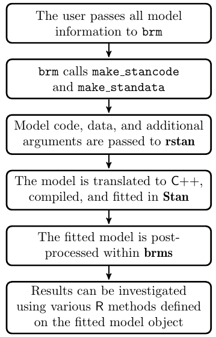

<style type="text/css">
slides > slide:not(.nobackground):after {
  content: '';
}
</style>

```{r setup, include=FALSE}
options(width = 90)
library(knitr)
library(rgl)
knit_hooks$set(rgl = hook_plot_custom)
knit_hooks$set(small.mar = function(before, options, envir) {
    if (before) par(mar = c(4, 4, .1, .1), las = 1)  # smaller margin on top and right
})
hook_output <- knit_hooks$get("output")
knit_hooks$set(output = function(x, options) {
  lines <- options$output.lines
  if (is.null(lines)) {
    return(hook_output(x, options))  # pass to default hook
  }
  x <- unlist(strsplit(x, "\n"))
  more <- "..."
  if (length(lines)==1) {        # first n lines
    if (length(x) > lines) {
      # truncate the output, but add ....
      x <- c(head(x, lines), more)
    }
  } else {
    x <- c(more, x[lines], more)
  }
  # paste these lines together
  x <- paste(c(x, ""), collapse = "\n")
  hook_output(x, options)
})
```

## Frequentist Estimation of Multilevel Models

- Frequentists assume that $a_j$ and $b_j$ deviate from the common parameters according
  to a (multivariate) normal distribution, whose (co)variances are common parameters
  to be estimated
- To Frequentists, $a_j$ and $b_j$ are not parameters because parameters must remained
  fixed in repeated sampling of observations from some population
- Since $a_j$ and $b_j$ are not parameters, they can't be "estimated" only "predicted"
- Since $a_j$ and $b_j$ aren't estimated, they must be integrated out of
  the likelihood function, leaving an integrated likelihood function of the common parameters
- After obtaining maximum likelihood estimates of the common parameters, each
  $a_j$ and $b_j$ can be predicted from the residuals via a regression
- Estimated standard errors produced by frequentist software are too small
- There are no clearly-defined standard errors for the $a_j$ and $b_j$
- Maximum likelihood estimation often results in a corner solution

## Table 2 from the **lme4** [Vignette](https://www.jstatsoft.org/article/view/v067i01/0) (see also the [FAQ](https://bbolker.github.io/mixedmodels-misc/glmmFAQ.html#model-specification))


## Hierarchical Models in Psychology

- In political science and economics, the "big" units are often countries or sub-national
  political areas like states and the "small" units are people
- In [psychology](https://arxiv.org/pdf/1506.04967.pdf), the "big" units are often people and 
  the "small" units are questions or outcomes on repeated tasks
- Hierarchical model syntax is like
```{r, eval = FALSE}
y ~ x + (x | person) + (1 | question)
```

> - Question of interest is how to predict `y` for a new "big" unit (person) and
  Bayesian hierarchical models do much better than anything else

## Hierarchical Models in **rstanarm** (from this [paper](http://www.tqmp.org/RegularArticles/vol14-2/p099/p099.pdf))

```{r, message = FALSE}
dat <- readr::read_csv("https://osf.io/5cg32/download")
library(rstanarm)
options(mc.cores = parallel::detectCores())
```

```{r, psych, cache = TRUE, results = "hide", warning = FALSE}
post <-  stan_glmer(valence ~ arousal + (1 + arousal | PID), data = dat,
                    prior = normal(0, 1), prior_intercept = normal(50, 100))
```
<div class="columns-2">
```{r, output.lines = (6:20), warning = FALSE}
post
```
</div>

## PSISLOOCV (within a group)

```{r, output.lines = 4:16}
loo(post)
```

## Accessor Functions (based on the **lme4** package)

```{r}
fixef(post)
cbind(b = head(ranef(post)$PID), total = head(coef(post)$PID))
dim(as.matrix(post)) # 4000 x 46
```

## Posterior Predictive Checks

```{r, fig.width=10, fig.height=5}
pp_check(post, plotfun = "ribbon_grouped", x = dat$arousal, group = dat$PID)
```

## Prior Predictive Distribution for Well Switching {.build}

```{tikz, fig.cap = "Well Switching Model", fig.ext = 'png', echo = FALSE}
\usetikzlibrary{bayesnet}
\begin{tikzpicture}[node distance=2cm, auto,>=latex', thick, scale = 0.07]

  % Define nodes

  % Y
  \node[obs]          (y)   {switch?}; %

  % Xs
  \node[obs, left=7 of y] (d) {distance}; %
  \node[obs, above=0.25 of d] (t)  {arsenic}; %

  % conditional mean function
  \node[det, right=3 of d] (n) {$\eta$} ; %
  \node[det, right=5 of d] (m) {$\mu$} ; %

  % parameters
  \node[latent, above=2.4 of n]   (a) {$\alpha$} ; %
  \node[latent, above=2.0 of d]  (bk) {$\beta_k$}  ; %

  \edge {a,bk,d,t} {n} ; %
  \edge {n} {m} ; %
  \node[const, right=0.4 of n, yshift=-0.5cm] (inv_logit) {logit$^{-1}$} ; %

  % Factors
  \factor[left=of y] {y-f} {below:$\mathcal{B}$} {m} {y} ; %
  \factor[above=of a] {a-f} {right:$\mathcal{N}$} {} {a}; %
  \factor[above=of bk] {bk-f} {left:$\mathcal{N}$} {} {bk} ; %
  
  % Hyperparameters
  \node[const, above=0.4 of a-f, xshift=-0.2cm] (m_a) {$m_\alpha$} ; %
  \node[const, above=0.4 of a-f, xshift=+0.2cm] (s_a) {$s_\alpha$} ; %
  \edge[-] {m_a,s_a} {a-f} ; %
  \node[const, above=0.4 of bk-f, xshift=-0.25cm] (m_bk) {$0$} ; %
  \node[latent, above=0.4 of bk-f, xshift=+0.5cm] (s_b) {$\sigma_{\beta}$} ; %
  \edge[-] {m_bk,s_b} {bk-f} ; %
  \node[const, left=1.0 of m_a] (r) {$r$} ; %
  \factor[right=1.0 of s_b] {s-f} {below:$\mathcal{E}$} {r} {s_b}; %

  % Plates
  \plate {yx} { %
    (y)(y-f)(y-f-caption) %
    (d)(y-f)(y-f-caption) %
    (t)(y-f)(y-f-caption) %
  } {$\forall n \in 1, 2, \dots, N$} ;
\end{tikzpicture}
```

## Prior Predictive Distribution in Symbols

$$
\sigma_\beta: \thicksim \mathcal{E}\left(r\right) \\
\forall k: \beta_k \thicksim \mathcal{N}\left(0, \sigma_\beta\right) \\
\alpha \thicksim \mathcal{N}\left(m_\alpha, s_\alpha\right) \\
\forall n: \eta_n \equiv \alpha + s\left(ARSENIC_n, DISTANCE_n, \beta_1 \dots \beta_K\right) \\
\forall n: \epsilon_n \thicksim \mathcal{L}\left(0,1\right) \\
\forall n: u_n \equiv \eta_n + \epsilon_n \\
\forall n: Y_n \equiv u_n > 0
$$

* $s\left(\cdot\right)$ is a smooth but non-linear function of arsenic and
  well-distance that has many coefficients, each of which has a normal prior
  with expectation zero and standard deviation $\sigma_\beta$, which 
  has an exponential prior with expectation $r^{-1}$
* $\Pr\left(y_n  = 1 \mid \dots\right) = \Pr\left(\eta_n + \epsilon_n > 0\right) =
  \Pr\left(\epsilon_n > -\eta_n\right) = \Pr\left(\epsilon_n \leq \eta_n\right)$,
  which can evaluated using the standard logistic CDF,
  $F\left(\eta_n\right) = \frac{1}{1 + e^{-\eta_n}}$

## Posterior Distribution {.smaller}

```{r, logit, cache = TRUE, results = "hide"}
post <- stan_gamm4(switch ~ s(dist, arsenic), data = wells, family = binomial, adapt_delta = 0.98)
```
<div class="columns-2">
```{r, output.lines = -(1:5)}
print(post, digits = 2)
```
</div>

## Nonlinear Plot

```{r, message = FALSE, warning=FALSE, fig.height=5, fig.width=10}
plot_nonlinear(post) # coloring is in log-odds units
```

## Covariance and Correlation Matrices

- Recall that if $g\left(X_{i},X_{j}\right)=\left(X_{i}-\mu_{i}\right)\left(X_{j}-\mu_{j}\right)$, then
\vspace{-0.2in}
$$\begin{eqnarray*}
\mathbb{E}g\left(X_{i},X_{j}\right) & = & \int_{\Omega_{X_{j}}}\int_{\Omega_{X_{i}}}\left(x_{i}-\mu_{i}\right)\left(x_{j}-\mu_{j}\right)
f\left(x_{i},x_{j}\right)dx_{i}dx_{j}=\sigma_{ij}
\end{eqnarray*}$$

is the covariance between $X_{i}$ and $X_{j}$, while $\rho_{ij}=\frac{\sigma_{ij}}{\sigma_{i}\sigma_{j}}\in\left[-1,1\right]$
is their correlation, which is a measure of LINEAR dependence

- Let $\boldsymbol{\Sigma}$ and $\boldsymbol{\Lambda}$  be $K\times K$, such that
$\Sigma_{ij}=\sigma_{ij}\,\forall i,j$ and $\Lambda_{ij} = \rho_{ij}\,\forall i\neq j$
    - Since $\sigma_{ij}=\sigma_{ji}\,\forall i,j$, $\boldsymbol{\Sigma}=\boldsymbol{\Sigma}^{\top}$
    is symmetric
    - Since $\sigma_{ij}=\sigma_{i}^{2}$ iff $i=j$, $\Sigma_{ii}=\sigma_{i}^{2}>0$
    - Hence, $\boldsymbol{\Sigma} = 
    \mathbb{E}\left(\mathbf{x} - \boldsymbol{\mu}\right)\left(\mathbf{x} - \boldsymbol{\mu}\right)^\top$ 
    is the variance-covariance matrix of $\mathbf{x}$
    - $\boldsymbol{\Sigma}=\boldsymbol{\Delta}\boldsymbol{\Lambda}\boldsymbol{\Delta}$
where $\boldsymbol{\Delta}$ is a diagonal matrix of standard deviations

## Multivariate CDFs, PDFs, and Expectations {.smaller}

- If $\mathbf{x}$ is a $K$-vector of continuous random variables
$$\begin{eqnarray*}
F\left(\mathbf{x}\right) & = & \Pr\left(X_{1}\leq x_{1}\bigcap X_{2}\leq x_{2}\bigcap\cdots\bigcap X_{K}\leq x_{K}\right)\\
f\left(\mathbf{x}\right) & = & \frac{\partial^{K}F\left(\mathbf{x}\right)}{\partial x_{1}\partial x_{2}\cdots\partial x_{K}}=f_1\left(x_{1}\right)\prod_{k=2}^{K}f_k\left(\left.x_{k}\right|x_{1},\ldots,x_{k-1}\right)\\
F\left(\mathbf{x}\right) & = & \int_{-\infty}^{x_{k}}\cdots\int_{-\infty}^{x_{2}}\int_{-\infty}^{x_{1}}f\left(\mathbf{x}\right)dx_{1}dx_{2}\cdots dx_{K}
\end{eqnarray*}$$
$$\begin{eqnarray*}
\mathbb{E}g\left(\mathbf{x}\right) & = & \int_{-\infty}^{\infty}\cdots\int_{-\infty}^{\infty}\int_{-\infty}^{\infty}g\left(\mathbf{x}\right)f\left(\mathbf{x}\right)dx_{1}dx_{2}\cdots dx_{K}\\
\boldsymbol{\mu}^{\top} & = & \mathbb{E}\mathbf{x}^{\top}=\begin{bmatrix}\mathbb{E}X_{1} & \mathbb{E}X_{2} & \cdots & \mathbb{E}X_{K}\end{bmatrix}\\
\boldsymbol{\Sigma}^{\top}=\boldsymbol{\Sigma} & = & \mathbb{E}\left[\left(\mathbf{x}-\boldsymbol{\mu}\right)\left(\mathbf{x}-\boldsymbol{\mu}\right)^{\top}\right]=\begin{bmatrix}\sigma_{1}^{2} & \sigma_{12} & \cdots & \sigma_{1K}\\
\sigma_{12} & \sigma_{2}^{2} & \cdots & \vdots\\
\vdots & \cdots & \ddots & \sigma_{\left(K-1\right)K}\\
\sigma_{1K} & \cdots & \sigma_{\left(K-1\right)K} & \sigma_{K}^{2}
\end{bmatrix}
\end{eqnarray*}$$

## Cholesky Factors and Positive Definiteness

- Let $\mathbf{L}$ be lower triangular w/ positive diagonal entries
such that $\mathbf{L}\mathbf{L}^{\top}=\boldsymbol{\Sigma}$, which is a 
Cholesky factor of $\boldsymbol{\Sigma}$ and can uniquely be defined via recursion:
$$\begin{eqnarray*}
L_{ij} & = & \begin{cases}
\sqrt[+]{\Sigma_{jj}-\sum_{k=1}^{j-1}L_{kj}^{2}} & \mbox{if }i=j\\
\frac{1}{L_{jj}}\left(\Sigma_{ij}-\sum_{k=1}^{j-1}L_{ik}L_{jk}\right) & \mbox{if }i>j\\
0 & \mbox{if }i<j
\end{cases}
\end{eqnarray*}$$
- Positive definiteness of $\boldsymbol{\Sigma}$ implies $L_{jj}$
is real and positive for all $j$ and implies the existence of $\boldsymbol{\Sigma}^{-1}=\mathbf{L}^{-1}\left(\mathbf{L}^{-1}\right)^{\top}$,
which is called a "precision matrix". But not all symmetric matrices
are positive definite, so $\Theta\subset\mathbb{R}^{K+{K \choose 2}}$ in this case
- The `cholesky_decompose` function in Stan outputs $\mathbf{L}$, while the `chol` function 
  in R outputs $\mathbf{L}^{\top}$ instead

## Determinants

- A determinant is "like" a multivariate version of the absolute
value operation and is denoted with the same symbol, $\left|\mathbf{X}\right|$
- Iff $\left|\mathbf{X}\right|\neq0$, then $\mathbf{X}^{-1}$ exists
and $\left|\mathbf{X}^{-1}\right|=\frac{1}{\left|\mathbf{X}\right|}$
- All you need to know about how determinants are calculated:
    * Determinant of a product of square matrices is
    equal to the product of their determinants
    * Determinant of a triangular matrix is the product of its
    diagonal elements
    * Thus, the determinant of a covariance matrix is the squared
    product of the diagonal elements of its Cholesky factor

## Frequentist Example

```{r, message = FALSE, warning = FALSE}
poll <- readRDS("GooglePoll.rds") # WantToWin is coded as 1 for Romney and 0 for Obama
poll$Income[poll$Income == "150,000+"] <- "100,000-149,999"
library(dplyr)
collapsed <- filter(poll, !is.na(WantToWin)) %>%
             group_by(Region, Gender, Urban_Density, Age, Income) %>%
             summarize(Romney = sum(grepl("Romney", WantToWin)), Obama = n() - Romney) %>%
             na.omit
```
```{r, glmer, cache = TRUE, results = "hide", warning = FALSE}
mle <- lme4::glmer(cbind(Romney, Obama) ~ Gender + Urban_Density + Age + Income +
                  (Gender + Urban_Density + Age + Income | Region),
                  data = collapsed, family = binomial(link = "logit"))
```

> - For models that are more complicated than `(1 + x | g)`, the MLE of $\boldsymbol{\Sigma}$ 
  usually implies that $\widehat{\boldsymbol{\Sigma}}^{-1}$ does not exist

## The LKJ Distribution for Correlation Matrices

- Let $\boldsymbol{\Delta}$ be a $K\times K$ diagonal matrix such
that $\Delta_{kk}$ is the $k$-th standard deviation, $\sigma_{k}$,
and let $\boldsymbol{\Lambda}$ be a correlation matrix
- Formulating a prior for 
$\boldsymbol{\Sigma}=\boldsymbol{\Delta}\boldsymbol{\Lambda}\boldsymbol{\Delta}$
is harder than putting a prior on $\boldsymbol{\Delta}$ & $\boldsymbol{\Lambda}$
- LKJ PDF is $f\left(\left.\boldsymbol{\Lambda}\right|\eta\right)=\frac{1}{c\left(K,\eta\right)}\left|\boldsymbol{\Lambda}\right|^{\eta-1}=\left|\mathbf{L}\right|^{2\left(\eta-1\right)}$
where $\boldsymbol{\Lambda}=\mathbf{L}\mathbf{L}^{\top}$ with $\mathbf{L}$
a Cholesky factor and $c\left(K,\eta\right)$ is the normalizing constant
that forces the PDF to integrate to $1$ over the space of correlation matrices
    - Iff $\eta=1$, $f\left(\left.\boldsymbol{\Lambda}\right|\eta\right)=\frac{1}{c\left(K,\eta\right)}$ is constant
    - If $\eta>1$, the mode of $f\left(\left.\boldsymbol{\Lambda}\right|\eta\right)$ is at $\mathbf{I}$ and as $\eta\uparrow\infty$, $\boldsymbol{\Lambda}\rightarrow\mathbf{I}$
    - If $0<\eta<1$, trough of $f\left(\left.\boldsymbol{\Lambda}\right|\eta\right)$ is at $\mathbf{I}$, which is 
    an odd thing to believe
- Can also derive the distribution of the Cholesky factor $\mathbf{L}$ such that 
  $\mathbf{L}\mathbf{L}^\top$ is
  a correlation matrix with an LKJ$\left(\eta\right)$ distribution

## Stuff for the Data Block

```{r, message = FALSE}
library(lme4)
X <- model.matrix(mle)[ , -1]
Z <- getME(mle, name = "Z")
class(Z)
parts <- rstan::extract_sparse_parts(Z)
str(parts)
```

## Bayesian Version of the "Same" Model {.smaller}

```{r, post_h, cache = TRUE, results = "hide"}
post_h <- stan_glmer(cbind(Romney, Obama) ~ Gender + Urban_Density + Age + Income +
                       (Gender + Urban_Density + Age + Income | Region),
                     data = collapsed, family = binomial(link = "logit"), 
                     QR = TRUE, adapt_delta = 0.98, seed = 12345)
```
<div class="columns-2">
```{r, output.lines = -(1:6)}
post_h
```
</div>

## Matrix Factorization

- How many ways can $24$ be factored over the positive integers?

    1. $1 \times 24$
    2. $2 \times 12$
    3. $3 \times 8$
    4. $4 \times 6$
    5. $2^3 \times 3$

> - Matrices can be factored into the product of two (or more) special matrices, and
    the restrictions on the special matrices can make the factorization unique, such
    as $\boldsymbol{\Sigma} = \boldsymbol{\Delta} \boldsymbol{\Lambda} \boldsymbol{\Delta}$
  
> - Another example is the QR factorization $\underbrace{\mathbf{X}}_{N \times K} = 
  \underbrace{\mathbf{Q}}_{N \times K} \underbrace{\mathbf{R}}_{K \times K}$,
  where $\mathbf{Q}^\top \mathbf{Q} = \mathbf{I}$ and $\mathbf{R}$ is upper
  triangular with non-negative diagonal elements
  
## What Does `QR = TRUE` Do?

- Let the vector of linear predictions in a GLM be $\boldsymbol{\eta} = \mathbf{X} \boldsymbol{\beta}$
- If we apply the QR decomposition to $\mathbf{X}$, 
  $$\boldsymbol{\eta} = \overbrace{\mathbf{Q}\mathbf{R}}^\mathbf{X} \boldsymbol{\beta} = 
  \overbrace{\mathbf{Q} \frac{R_{KK}}{R_{KK}}\mathbf{R}}^\mathbf{X}\boldsymbol{\beta} =
  \overbrace{\mathbf{Q}^\ast\mathbf{R}^\ast}^\mathbf{X} \boldsymbol{\beta} =
  \mathbf{Q}^\ast \overbrace{\boldsymbol{\theta}}^{\mathbf{R}^\ast\boldsymbol{\beta}}$$
- When you specify `QR = TRUE`, rstanarm internally does a GLM using 
  $\mathbf{Q}^\ast = \mathbf{Q} R_{KK}$ as the matrix of predictors instead of $\mathbf{X}$ 
  to get the posterior distribution of $\boldsymbol{\theta}$ and then pre-multiplies each 
  posterior draw of $\boldsymbol{\theta}$ by $\frac{1}{R_{KK}} \mathbf{R}^{-1}$ to get a 
  posterior draw of $\boldsymbol{\beta}$
- Doing so makes it easier for NUTS to sample from the posterior distribution 
  (of $\boldsymbol{\theta}$) efficiently because the columns of $\mathbf{Q}$ are orthogonal, 
  whereas the columns of $\mathbf{X}$ are not

## Distributions of Different Random Variables

> - $\alpha$ and each $\beta_k$ have a posterior (or prior) distribution
  in a regression model
> - Let $\eta_n = \alpha + \sum_{k = 1}^K \beta_k x_{nk}$. The `posterior_linpred`
  function produces draws of each $\eta_n$ induced by the posterior distribution
  of $\alpha$ and each $\beta_k$
> - In a GLM, $\mu_n = g\left(\eta_n\right)$. The `posterior_epred` function
  produces draws of each $\mu_n$ induced by the posterior distribution of $\eta_n$
> - The P{D,M}F of the outcome is $f\left(y_n \mid \mu_n, \dots\right)$. The
  `posterior_predict` function produces draws of each $y_n$ induced by the
  posterior distribution of $\mu_n$ whose P{D,M}F is 
  $f\left(y_n \mid \mu_n, \dots\right)$
> - But $y_n$ is not conditionally deterministic given $\mu_n$ because it
  includes noise, whose posterior distribution may be governed by other
  parameters like $\sigma$
> - In the case of a logit model, $\eta_n \in \mathbb{R}$,
  $\mu_n = \frac{1}{1 + e^{-\eta_n}} \in \left(0,1\right)$, and
  $y_n \in \{0,1\}$

## Poststratification {.build}

```{r}
mu <- posterior_epred(post_h); dim(mu)
```

```{r}
table(poll$Gender)
```

> - Assume `shares` is the proportion of voters in the population for each level of
`Gender`, `Urban_Density`, `Age`, and `Income` crossed with `Region`
```{r, eval = FALSE}
mu_ <- mu %*% shares
```

> - Now you have a posterior distribution for the proportion
  supporting Romney for the country as a whole

## What Were the Priors?

```{r}
prior_summary(post_h)
```

## What Is `decov(1, 1, 1, 1)`?

- `decov` = Decomposition of Covariance
- `reg.` is the regularization parameter in the LKJ prior on the correlation matrix
- `conc.` is the concentration parameter in the Dirichlet prior on the variance components
- `shape` and `scale` pertain to the Gamma prior on multiplier for the variance components

> - You usually do not need to change these defaults to get good results

## Dirichlet Distribution

- Dirichlet distribution is over the parameter space of PMFs --- i.e. $\pi_k \geq 0$ and 
  $\sum_{k = 1}^K \pi_k = 1$ --- and the Dirichlet PDF is
$f\left(\boldsymbol{\pi} \mid \boldsymbol{\alpha}\right) = \frac{1}{B\left(\boldsymbol{\alpha}\right)}\prod_{k=1}^{K}\pi_{k}^{\alpha_{k}-1}$
where $\alpha_{k}\geq0\,\forall k$ and the multivariate Beta
function is $B\left(\boldsymbol{\alpha}\right)=\frac{\prod_{k=1}^{K}\Gamma\left(\alpha_{k}\right)}{\Gamma\left(\prod_{k=1}^{K}\alpha_{k}\right)}$
where $\Gamma\left(z\right)= \frac{1}{z} \prod_{n = 1}^\infty \frac{\left(1 + \frac{1}{n}\right)^n}
{1 + \frac{z}{n}} = \int_{0}^{\infty}u^{z-1}e^{-u}du$ is the Gamma function
- $\mathbb{E}\pi_{i}=\frac{\alpha_{i}}{\sum_{k=1}^{K}\alpha_{k}}\,\forall i$
and the mode of $\pi_{i}$ is $\frac{\alpha_{i}-1}{-1+\sum_{k=1}^{K}\alpha_{k}}$
if $\alpha_{i}>1$
- Iff $\alpha_{k}=1\,\forall k$, $f\left(\left.\boldsymbol{\pi}\right|\boldsymbol{\alpha}=\mathbf{1}\right)$
is constant over $\Theta$ (simplexes)
- Beta distribution is a special case of the Dirichlet where $K = 2$
- Marginal and conditional distributions for subsets of $\boldsymbol{\pi}$ are also Dirichlet

## The **brms** Workflow (Figure 1 in Bürkner 2016)



## The Arguments to `brm`

```{r, message = FALSE}
library(brms)
args(brm)
```

## The `formula` Argument to `brm`

* Everything to the right of the `~` is the same as in many other R functions
* In many cases, the thing to the left of the `~` is simply the outcome variable
* However, `brm` introduces a new possibility for this syntax like `y | fun(variable)`,
  where `fun` could be
    * `cens()` and `trunc()` to specify known censoring or truncation bounds
    * `weights()` and `disp()`, which should not be used with MCMC
    * `se()` to specify "known" standard errors in meta-analyses
    * `trials()`, which is used in binomial models only
    * `cat()` to specify the possible categories for ordinal models

## The `family` Argument to `brm`

The `family` argument can be any of the following functions, which also have a 
link argument that can be a variety of things depending on the family
```{r, eval = FALSE}
gaussian; student; binomial; bernoulli; poisson; negbinomial; geometric; Gamma; 
skew_normal; lognormal; shifted_lognormal; exgaussian; wiener; inverse.gaussian; 
exponential; weibull; frechet; Beta; dirichlet; von_mises; asym_laplace; 
gen_extreme_value; categorical; multinomial; cumulative; cratio; sratio; acat; 
hurdle_poisson; hurdle_negbinomial; hurdle_gamma; hurdle_lognormal; 
zero_inflated_binomial; zero_inflated_beta; zero_inflated_negbinomial; 
zero_inflated_poisson; zero_one_inflated_beta
```

> - The ones involving `hurdle_`, `zero_inflated_` and / or `negbinomial` are
  of particular interest in the social sciences

## The `prior` Argument to `brm` {.smaller}

```{r}
args(set_prior) # or usually just prior()
```

* `prior` is a character string (in the Stan language) such as `"normal(0,5)"` but you can omit the quotation marks if you instead call `prior`, which forwards to `set_prior`
* `class` indicates what parameters the call to `set_prior` pertains to
* `coef` is the name of the parameter in question
* `group` is the name of the grouping factor (if applicable)
* `resp` is the name of the response variable in multivariate models
* `dpar` is the name of the distribution parameter (if applicable)
* `nlpar` is the name of the non-linear parameter (if applicable)
* `lb` is the lower bound of the parameter (default $-\infty$)
* `ub` is the upper bound of the parameter (default $\infty$)
* `check` whether priors should be checked for validity

## The `get_prior` Function

* Input the `formula`, `data`, and `family` and get back the possible prior choices (and defaults)

```{r}
data(roaches, package = "rstanarm"); roaches <- roaches[roaches$roach1 > 0, ]
get_prior(y ~ log(roach1) + treatment + senior + offset(log(exposure2)), 
          data = roaches, family = zero_inflated_negbinomial)
```

## The `class` Argument to `set_prior`

* Refers to a type of parameter in the model 
* Defaults to `"b"` which refers to (population-level) regression coefficients
* Other possible values are `"Intercept"`, `"sd"`, `"cor"`, `"sigma"` and others we may talk about
  later
```{r}
my_prior <- prior(normal(0, 2), class = "b") + prior(normal(0, 5), class = "Intercept") +
  prior(exponential(1), class = "shape")
```

## Example of `brm`

```{r, roaches, cache = TRUE, message = FALSE, results = "hide", warning = FALSE}
post <- brm(y ~ log(roach1) + treatment + senior + offset(log(exposure2)), data = roaches, 
            family = zero_inflated_negbinomial, prior = my_prior)
```
```{r, output.lines = -c(1:8)}
post
```

## Using the `pp_check` Function

```{r, message = FALSE, warning = FALSE}
pp_check(post, type = "loo_intervals") # type is the same as plotfun with rstanarm
```

## Using the `hypothesis` Function

* To do this with **rstanarm**, you would have to first call `as.matrix`
```{r}
args(brms:::hypothesis.brmsfit)
```
* Here `x` is the object produced by `brm` and `hypothesis` is a string, typically with an 
  embedded `<` or `>`, such as
```{r}
hypothesis(post, "treatment < 0")
```

## Other Post-Estimation Methods {.smaller}

Many of the things you can do with an object produced by `brm` are analagous to **rstanarm**
```{r, echo = FALSE}
matrix(c(gsub("\\.brmsfit$", "", methods(class = "brmsfit"))), ncol = 3)
```

## Gaussian Processes {.smaller}

A simple Gaussian Process logit model with a squared exponential covariance function is

- $\frac{1}{\rho} \thicksim \mathcal{Gamma}\left(a,b\right)$
- $\alpha \thicksim \mathcal{t}_+\left(v, 0, s\right)$
- $\Sigma_{ij} = \Sigma_{ji} = \alpha^2 e^{-\frac{1}{\rho} \sum_{d = 1}^D \left(x_{id} - x_{jd}\right)^2}$
- $\gamma \thicksim \mathcal{N}\left(0, 2\right)$
- $\boldsymbol{\eta} \thicksim \mathcal{N}\left(\gamma \mathbf{1}, \boldsymbol{\Sigma}\right)$
- $\mu_j = \frac{1}{1 + e^{-\eta_j}}$
- $y_j \thicksim$ Binomial$\left(n_j, \mu_j\right)$

where, for example, $n_j$ is the number of coronavirus tests in zipcode $j$ and $y_j$ is
the number of positives

```{r, GP, cache = TRUE, message = FALSE, results = "hide", warning = FALSE}
tests <- readr::read_csv("https://raw.githubusercontent.com/nychealth/coronavirus-data/master/latest/last7days-by-modzcta.csv")
zipcodes <- readr::read_csv("https://gist.githubusercontent.com/erichurst/7882666/raw/5bdc46db47d9515269ab12ed6fb2850377fd869e/US%2520Zip%2520Codes%2520from%25202013%2520Government%2520Data")
zipcodes$ZIP <- as.integer(zipcodes$ZIP)
tests <- inner_join(tests, zipcodes, by = c("modzcta" = "ZIP"))
post <- brm(people_positive | trials(people_tested) ~ 1 + gp(LAT, LNG, k = 15, c = 5 / 4), 
            data = tests, family = binomial, save_pars = save_pars(all = TRUE))
```

## What Did the Gaussian Process Model Imply?

```{r, plots, cache = TRUE, message = FALSE, fig.width=10, fig.height=5}
conditional_effects(post, effects = "LNG:LAT")
```

## How Good Was the Model? {.build}

```{r}
bayes_R2(post)
```

```{r}
loo(post, moment_match = TRUE)
```
